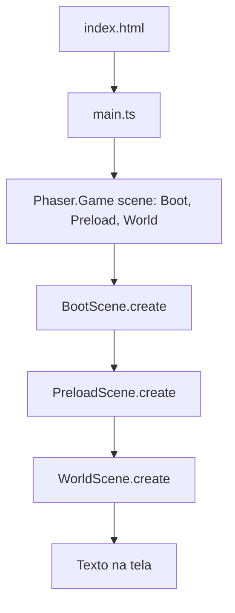

```mermaid
flowchart TD
    A[index.html] --> B[main.ts]
    B --> C[Phaser.Game scene: Boot, Preload, World]
    C --> D[BootScene.create]
    D --> E[PreloadScene.create]
    E --> F[WorldScene.create]
    F --> G[Texto na tela]
```
